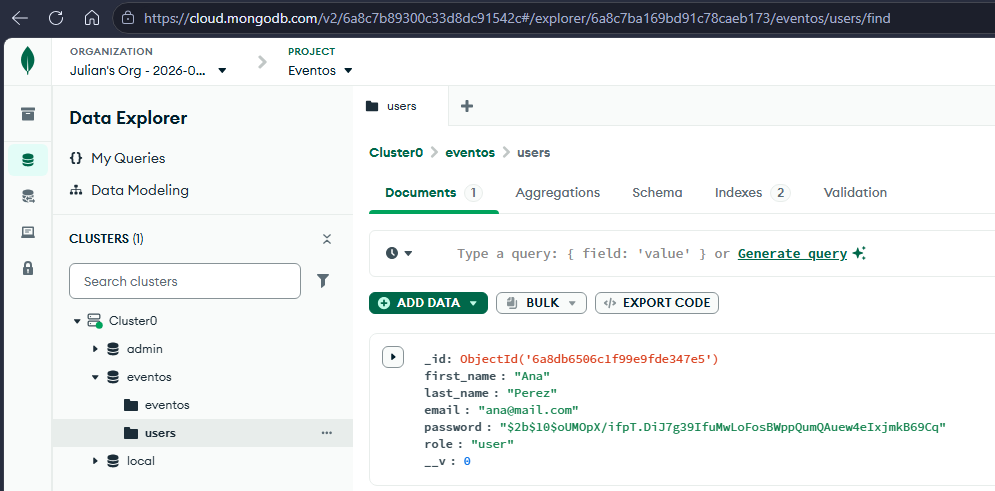

# Plataforma de Eventos

API REST desarrollada con Node.js y Express para la gestión de una plataforma de eventos e inscripciones.

El proyecto está organizado con una arquitectura por capas para facilitar su mantenimiento y permitir que pueda crecer en próximas actualizaciones.


## Tecnologías

- Node.js
- Express
- MongoDB
- Mongoose
- bcrypt
- dotenv
- JavaScript con módulos ESM
- jsonwebtoken
- Passport.js
- passport-local
- passport-custom
- cookie-parser

## Instalación

Clonar el repositorio e instalar las dependencias:

```bash
npm install
```


## Variables de entorno
Crear un archivo .env en la raíz del proyecto tomando como referencia el archivo .env.example.

Variables necesarias:

PORT=8080
NODE_ENV=development
MONGO_URL=
JWT_SECRET=
JWT_EXPIRES_IN=1h

El archivo .env contiene información privada y no debe subirse al 
repositorio.


## Ejecutar el proyecto
Para ejecutar el proyecto en modo desarrollo:
```bash
npm run dev
```
Para ejecutar el proyecto normalmente:
```bash
npm start
```
Por defecto, el servidor se ejecuta en:
http://localhost:8080


## Estructura de carpetas
src/
```text
src/
src/
├── app.js
├── server.js
├── config/
│   ├── database.js
│   └── passport.config.js
├── routes/
│   ├── events.router.js
│   ├── sessions.router.js
│   └── users.router.js
├── controllers/
│   ├── events.controller.js
│   ├── sessions.controller.js
│   └── users.controller.js
├── services/
│   └── sessions.service.js
├── repositories/
│   └── users.repository.js
├── dao/
│   └── users.dao.js
├── models/
│   ├── User.js
│   └── Event.js
├── middlewares/
│   ├── auth.middleware.js
│   └── authorize.middleware.js
└── utils/
    ├── hash.js
    └── jwt.js
```


## Arquitectura
El proyecto está organizado por capas:

Ruta > Middleware/Passport > Controller > Service > Repository > DAO > Modelo > MongoDB 


## Modelo User
El modelo de usuario contiene:
- first_name
- last_name
- email
- password
- role

Los roles permitidos son:
- user
- organizer
- admin

El rol por defecto es `user`.

El registro público no permite crear usuarios con rol `organizer` o `admin` desde el body.


## Autenticación con Passport.js
Las estrategias de autenticación están centralizadas en: src/config/passport.config.js

Actualmente existen tres estrategias:

### register
Se utiliza para registrar nuevos usuarios.
La estrategia se encarga de:
- Validar campos obligatorios.
- Validar el formato del email.
- Normalizar el email con trim() y toLowerCase().
- Validar la longitud mínima de la contraseña.
- Verificar que el email no esté registrado.
- Hashear la contraseña con bcrypt.
- Crear el usuario en MongoDB.
- Asignar automáticamente el rol user.
El rol no puede modificarse desde el body del registro público.

### login
Se utiliza para validar las credenciales del usuario.
La estrategia:
- Normaliza el email.
- Busca el usuario por email.
- Compara la contraseña con bcrypt.
- Devuelve un mensaje genérico si las credenciales no son válidas.
Por seguridad, no se informa si el error corresponde al email o a la contraseña.

### current
Se utiliza para validar al usuario autenticado.
La estrategia:
- Lee la cookie currentUser.
- Verifica el JWT.
- Deja el payload del usuario disponible en req.user.
Si no existe una cookie válida o el JWT está vencido o manipulado, responde con 401 Unauthorized.


## JWT y cookies
Después de un login exitoso, el controller genera un JWT.
El token contiene:
```json
{
  "id": "...",
  "email": "usuario@mail.com",
  "role": "user"
}
```

El JWT se firma utilizando: JWT_SECRET

Su tiempo de expiración se configura mediante: JWT_EXPIRES_IN

El token se guarda en una cookie llamada: currentUser

Configuración de la cookie:
- httpOnly: true
- sameSite: "lax"
- maxAge: 3600000
- secure: true únicamente en producción


## Roles y autorización
El sistema utiliza autorización basada en roles para controlar qué acciones puede realizar cada usuario.

Los roles disponibles son:
- `user`
- `organizer`
- `admin`

### Matriz de permisos
```text
| Acción | user | organizer | admin |
|---|---|---|---|
| Consultar eventos publicados | ✅ | ✅ | ✅ |
| Crear eventos | ❌ | ✅ | ✅ |
| Modificar/cancelar eventos propios | ❌ | ✅ | ✅ |
| Modificar cualquier evento | ❌ | ❌ | ✅ |
| Ver todos los usuarios | ❌ | ❌ | ✅ |
```


## Middlewares de autenticación y autorización

### auth.middleware.js

El middleware de autenticación se encuentra en: src/middlewares/auth.middleware.js

Se encarga de:
- Leer el JWT desde la cookie `currentUser`.
- Verificar que el token sea válido.
- Guardar los datos del usuario en `req.user`.
- Responder `401 Unauthorized` si no existe una sesión válida.

### authorize.middleware.js
El middleware de autorización se encuentra en: src/middlewares/authorize.middleware.js

Recibe como parámetro los roles permitidos para acceder a una ruta.
Ejemplo:
```js
authorize("organizer", "admin")
```

Si el usuario está autenticado pero su rol no está permitido, responde con `403 Forbidden`.


## Diferencia entre 401 y 403

### 401 Unauthorized
Se utiliza cuando el usuario no tiene una sesión válida.

Puede ocurrir cuando:
- No existe la cookie `currentUser`.
- El JWT es inválido.
- El JWT está vencido.

Respuesta:
```json
{
  "status": "error",
  "message": "No autenticado"
}
```

### 403 Forbidden
Se utiliza cuando el usuario está autenticado, pero no tiene permisos suficientes para realizar una acción.

Respuesta:
```json
{
  "status": "error",
  "message": "No tenés permisos para realizar esta acción"
}
```


## Rutas disponibles

### GET /api/health
Permite verificar que el servidor esté funcionando.
Respuesta:
```json
{
  "status": "ok",
  "message": "Servidor activo"
}
```


### GET /api/events
Obtiene la lista de eventos.
Respuesta:
```json
{
  "status": "success",
  "payload": []
}
```


### POST /api/sessions/register
Registra un nuevo usuario.
Request:
```json
{
  "first_name": "Ana",
  "last_name": "Perez",
  "email": "Ana@Mail.com ",
  "password": "Secreta123"
}
```

Respuesta exitosa:
```json
{
  "status": "success",
  "payload": {
    "id": "665f2a...",
    "first_name": "Ana",
    "last_name": "Perez",
    "email": "ana@mail.com",
    "role": "user"
  }
}
```

Codigo HTTP: 201 Created
(La respuesta no incluye el campo password.)


#### Posibles errores

- Campos faltantes
```json
{
  "status": "error",
  "message": "Faltan campos obligatorios"
}
```
Código HTTP: 400 Bad Request

- Email inválido
```json
{
  "status": "error",
  "message": "Email inválido"
}
```
Código HTTP: 400 Bad Request

- Contraseña demasiado corta
```json
{
  "status": "error",
  "message": "La contraseña debe tener al menos 8 caracteres"
}
```
Código HTTP: 400 Bad Request

- Email ya registrado
```json
{
  "status": "error",
  "message": "El email ya está registrado"
}
```
Código HTTP: 409 Conflict


### POST /api/sessions/login
Inicia sesión con email y contraseña.
Request:
```json
{
  "email": "ana@mail.com",
  "password": "Secreta123"
}
```

Respuesta exitosa:
```json
{
  "status": "success",
  "message": "Login correcto"
}
```
Código HTTP: 200 OK

Además, el servidor genera un JWT y lo guarda en la cookie HTTP Only currentUser.
Si las credenciales son incorrectas:
```json
{
  "status": "error",
  "message": "Credenciales inválidas"
}
```
Código HTTP: 401 Unauthorized
El mensaje es el mismo tanto si el email no existe como si la contraseña es incorrecta.


### GET /api/sessions/current
Devuelve los datos del usuario autenticado.
Requiere una cookie currentUser válida.
Respuesta exitosa:
```json
{
  "status": "success",
  "payload": {
    "id": "665f2a...",
    "email": "ana@mail.com",
    "role": "user"
  }
}
```
Código HTTP: 200 OK

Si no existe una sesión válida:
```json
{
  "status": "error",
  "message": "No autenticado"
}
```
Código HTTP: 401 Unauthorized


### POST /api/sessions/logout
Cierra la sesión del usuario.
El endpoint elimina la cookie: currentUser
Respuesta:
```json
{
  "status": "success",
  "message": "Sesión cerrada"
}
```
Código HTTP: 200 OK


## Rutas protegidas por roles

### POST /api/events
Permite crear un nuevo evento.

Roles permitidos:
- organizer
- admin

Request:
```json
{
  "title": "Congreso Tech 2026",
  "description": "Evento de tecnología",
  "date": "2026-12-10",
  "location": "Buenos Aires",
  "capacity": 200
}
```

El campo organizer se asigna automáticamente utilizando el ID del usuario autenticado.

Respuesta exitosa:
```json
{
  "status": "success",
  "payload": {
    "id": "6690...",
    "title": "Congreso Tech 2026",
    "organizer": "665f2a..."
  }
}
```

Código HTTP: 201 Created

Si un usuario con rol user intenta crear un evento:
```json
{
  "status": "error",
  "message": "No tenés permisos para realizar esta acción"
}
```

Código HTTP: 403 Forbidden

Si se intenta acceder sin una sesión válida:
```json
{
  "status": "error",
  "message": "No autenticado"
}
```

Código HTTP: 401 Unauthorized


## PATCH /api/events/:id
Permite modificar un evento.

Roles permitidos:
- organizer
- admin

Un usuario con rol organizer solo puede modificar eventos creados por él.
Un usuario con rol admin puede modificar cualquier evento.

Request de ejemplo:
```json
{
  "title": "Congreso actualizado"
}
```

Si el organizer es propietario del evento: 200 OK

Si un organizer intenta modificar un evento creado por otro usuario:
```json
{
  "status": "error",
  "message": "No tenés permisos para modificar este evento"
}
```
Código HTTP: 403 Forbidden

Si el evento no existe:
```json
{
  "status": "error",
  "message": "Evento no encontrado"
}
```
Código HTTP: 404 Not Found

Un admin puede modificar cualquier evento aunque no sea el propietario.


## GET /api/users

Ruta administrativa que permite consultar todos los usuarios registrados.

Solo puede acceder un usuario con rol: admin


Si un user o organizer intenta acceder:
```json
{
  "status": "error",
  "message": "No tenés permisos para realizar esta acción"
}
```

Código HTTP: 403 Forbidden

Si accede un admin: 200 OK

La respuesta no incluye las contraseñas de los usuarios.


## Propiedad de recursos

Cada evento guarda el ID del usuario que lo creó en el campo: organizer

Al intentar modificar un evento se verifica:
- organizer dueño > puede modificar
- organizer ajeno > 403 Forbidden
- admin > puede modificar cualquier evento

De esta manera, la autorización se controla tanto por rol como por propiedad del recurso.


## Seguridad
Las contraseñas nunca se almacenan en texto plano.
El hash se realiza utilizando bcrypt mediante: src/utils/hash.js
La lógica de JWT se encuentra en: src/utils/jwt.js
La contraseña no se incluye:
- en las respuestas de la API;
- en el payload del JWT;
- en la información devuelta por /current.
- en la respuesta de /api/users.



## Passport y futuras estrategias
La configuración de Passport está centralizada en: src/config/passport.config.js
Esto permite agregar nuevas estrategias de autenticación sin modificar app.js.
El proyecto queda preparado para incorporar en el futuro proveedores externos como:
- Google
- GitHub
Por ejemplo, podrían agregarse nuevas estrategias como:
- google
- github
manteniendo centralizada la configuración de autenticación.


## Pruebas realizadas
Se comprobaron los siguientes casos:

- Registro exitoso.
- Registro con campos faltantes.
- Registro con email duplicado.
- Login exitoso.
- Login con email inexistente.
- Login con contraseña incorrecta.
- Login con credenciales faltantes.
- /current con cookie válida.
- /current sin cookie.
- Logout exitoso.
- /current devuelve 401 después del logout.
- Contraseña almacenada hasheada en MongoDB.
- Password no incluido en respuestas ni JWT.
- Ruta privada sin cookie > 401.
- POST /api/events con rol user > 403.
- POST /api/events con rol organizer > 201.
- organizer modificando su propio evento > 200.
- organizer intentando modificar un evento ajeno > 403.
- Ruta administrativa con organizer > 403.
- Ruta administrativa con admin > 200.
- admin modificando un evento ajeno > 200.